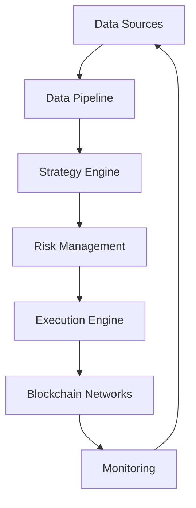

# DeFi-Kaiser: Quant Trading Bot for RWA and Dex

A high-frequency trading bot focused on Real-World Assets (RWA) and emerging chains like Berachain. Designed to automate cross-chain arbitrage and liquidity optimization strategies.

---

## 📊 Architecture Overview



## 🧩 Core Components
1. Data Pipeline
Sources:

RWA APIs (Ondo Finance, Centrifuge)

Berachain/EVM nodes

DEX liquidity pools

Key Files:

app/data/fetcher.py: Fetches real-time prices and yields

app/data/processors.py: Cleans and normalizes data

2. Strategy Engine
Location: app/strategies/

Key Strategies:

```mermaid
Copy
graph LR
  A[Cross-Chain Arbitrage] -->|RWA vs DeFi| B[Execution]
  C[Liquidity Mining] -->|Berachain Pools| B
Cross-Chain Arbitrage
```
File: `cross_chain_arb.py`

Logic:

python
Copy
if (rwa_yield - defi_yield) > threshold:
    execute_trade()
Liquidity Optimization
File: liquidity_mining.py

Logic:

python
Copy
best_pool = max(pools, key=lambda x: x.apr * (1 - x.il_risk))
3. Risk Management
Location: app/risk/

Key Checks:

Position sizing (max 10% per trade)

Liquidity thresholds ($500k+ TVL)

Market volatility circuit breakers

4. Execution Engine
Location: app/execution/

Features:

Multi-DEX order routing

Slippage control

MEV protection

5. Monitoring
Prometheus metrics endpoint (:8000/metrics)

Health checks (:8000/health)

