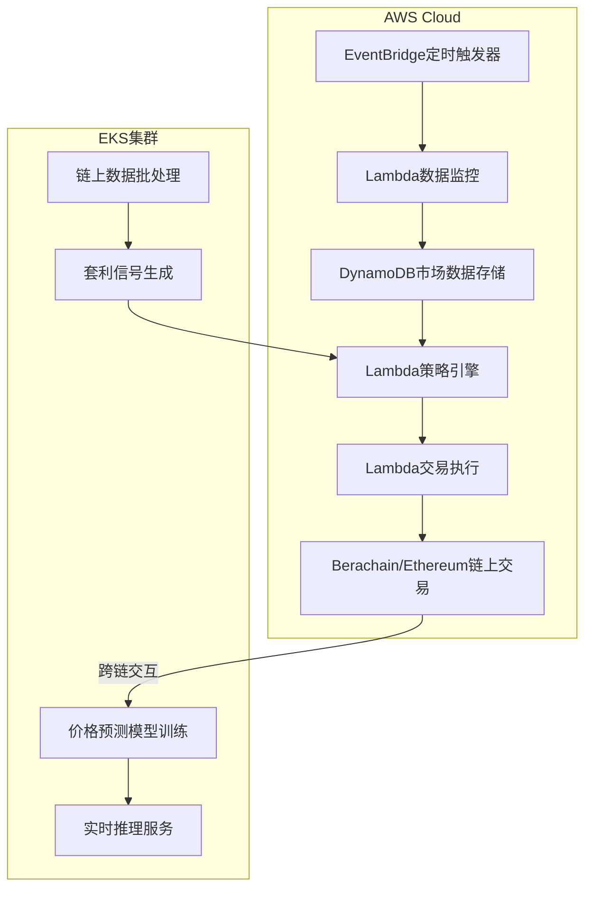

# 🚀 Crypto Quant Trading System

基于 **AWS Lambda + EKS + Berachain** 的量化交易系统，专注捕捉 _RWA套利_ 和 _新公链生态_ 机会。  
[](https://www.terraform.io/)
[](https://www.typescriptlang.org/)
[](LICENSE)

---

## 🌟 核心策略架构



🔍 策略详情
1. RWA 跨市场套利
操作流程

```python
def arbitrage_ousg():
    cex_price = get_cex_price('BYBIT', 'OUSG/USDT')       # CEX价格
    chain_price = get_ondo_redemption_price()             # 链上赎回价
    if cex_price < chain_price * 0.92:                    # 8%折价阈值
        amount = calc_position_size(cex_price)            # 头寸计算
        execute_cex_buy('BYBIT', amount)                  # CEX买入
        redeem_ondo(amount)                               # 链上赎回
        log_profit(chain_price - cex_price)               # 记录利润
```
关键参数
参数名	默认值	说明
DISCOUNT_RATE	8%	触发套利的最小折价率
MAX_POSITION	$10k	单次最大套利头寸
COOL_DOWN	1h	相同标的套利冷却时间


2. Berachain 生态挖矿
```python
const miningStrategy = {
  pools: [
    { 
      name: "HONEY/USDC",
      apr: 320,          // 基础收益率
      boost: {           // BGT加速机制
        tier1: { bgt: 1000, multiplier: 1.5 },
        tier2: { bgt: 5000, multiplier: 2.0 }
      },
      risks: ["智能合约漏洞", "稳定币脱钩"]
    }
  ],
  autoCompound: true,    // 自动复投
  gasOptimization: {     // Gas优化策略
    threshold: ">0.5%",  // 仅当收益>Gas成本时操作
    timeWindow: "3:00-4:00 UTC"  // 低Gas时段执行
  }
}
```

📦 数据需求清单
实时数据源
数据类型	来源	更新频率	示例API端点
RWA代币折价率	DefiLlama API	5分钟	/api/rwa/{protocol}
链上Gas费	Etherscan Gas Oracle	实时	/api?module=gastracker
Berachain LP收益率	The Graph Subgraph	15分钟	{ pools(first:5 orderBy:apr)
美联储利率预期	CME FedWatch Tool	每日	/api/fedwatch

```python
// 链上历史数据分析（EKS Spark任务）
struct ChainAnalysisJob {
    input_s3: "s3://raw-data/eth-blocks/",  // 原始区块数据
    output_s3: "s3://processed-data/arb-signals/", 
    processing: {
        window_duration: "24h",      // 分析时间窗口
        metrics: ["flashloan_volume", "mev_bot_activity"],
        anomaly_threshold: 2.5       // 标准差阈值
    }
}
```


## 部署指南

### 基础设施架构
```terraform
# Terraform 模块化架构
module "quant_stack" {
  source = "./modules/core"
  
  components = {
    lambda = {
      data_monitor   = { runtime = "python3.8", memory = 1024 }
      strategy_engine = { runtime = "nodejs18.x", timeout = 300 }
      trade_executor = { runtime = "nodejs18.x", vpc_access = true }
    }
    
    eks = {
      node_groups = {
        model_training = { instance_type = "m6i.xlarge", gpu = false }
        realtime_inference = { instance_type = "g5.xlarge", gpu = true }
      }
    }
    
    monitoring = {
      cloudwatch_alarms = ["lambda-errors", "eks-cpu-utilization"]
    }
  }
}
```

```bash
# 1. 克隆仓库
git clone https://github.com/yourname/crypto-quant-system.git
cd crypto-quant-system

# 2. 初始化AWS配置
aws configure import --profile quant-trading \
  --from-env-file .aws_credentials

# 3. 部署基础设施
terraform apply -var-file=environments/prod.tfvars

# 4. 构建并上传Lambda代码
./scripts/build_lambda.sh --env prod --parallel

# 5. 启动EKS计算集群
eksctl create cluster -f eks/cluster-config.yaml

# 6. 部署监控看板
cd monitoring/grafana
docker-compose up -d
```


## 📬 贡献指引
欢迎通过Issue提交以下改进：

新增数据源适配器（如Coinbase RWA API）

优化Berachain Gas费预测模型

开发跨链套利监控模块

增强EKS AutoScaling策略