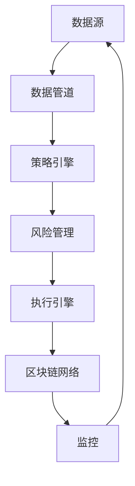
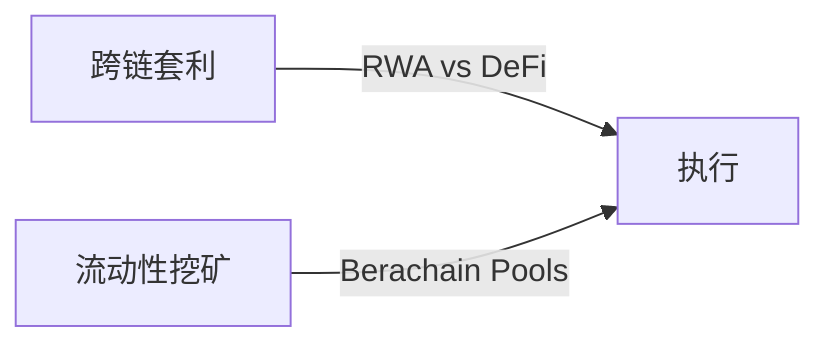

# DeFi-Kaiser: 面向RWA和Berachain的量化交易机器人

一个专注于现实世界资产（RWA）和新兴链（如Berachain）的高频交易机器人，旨在自动化跨链套利和流动性优化策略。

---

## 📊 架构概览



🧩 核心组件
1. 数据管道
数据源：

RWA API（Ondo Finance, Centrifuge）

Berachain/EVM节点

DEX流动性池

关键文件：

app/data/fetcher.py：获取实时价格和收益率

app/data/processors.py：清洗和标准化数据

2. 策略引擎
位置：app/strategies/

关键策略：



跨链套利
文件：cross_chain_arb.py

逻辑：
```python
if (rwa_yield - defi_yield) > threshold:
    execute_trade()
```

流动性挖矿
文件：liquidity_mining.py

逻辑：
```python
best_pool = max(pools, key=lambda x: x.apr * (1 - x.il_risk))
```

3. 风险管理
位置：app/risk/

关键检查：
* 头寸规模（每笔交易最多10%）
* 流动性阈值（TVL > $500k）
* 市场波动性熔断机制

4. 执行引擎
位置：app/execution/

功能：

* 多DEX订单路由
* 滑点控制
* MEV保护

5. 监控
位置：app/monitoring/

* Prometheus 指标端点（:8000/metrics）
* 健康检查（:8000/health）


📈 未来路线图
第二阶段（2024年Q3）：

* 机器学习价格预测
* 多链MEV保护

第三阶段（2024年Q4）：

* 投资组合再平衡引擎
* 机构级RWA集成